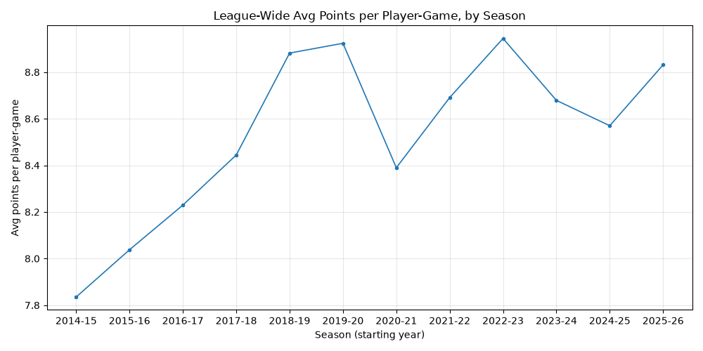

# NBA Analytics ETL Pipeline

An end-to-end ETL project that combines three data sources — a REST API, a CSV file, and a SQLite database — into a single normalized analytics warehouse, then runs SQL-based analysis that produces charts and CSV reports.

**Skills demonstrated:** Python (pandas, NumPy, SciPy, Matplotlib), SQL (SQLite), ETL design, data cleaning and validation, data visualization.

### Extract

| Source                      | Format   | Contents                                              |
| --------------------------- | -------- | ----------------------------------------------------- |
| `nba_api` (NBA stats API)   | REST API | ~5,000 player records                                 |
| `data/PlayerStatistics.csv` | CSV      | 433K+ player-game stat rows (2014-15 through 2025-26) |
| `data/source_games.db`      | SQLite   | Game metadata (teams, arena, attendance)              |

- The `PlayerStatistics` csv file was originally 1.7 million roles but I reduced it to about 400k rows. I acheieved this by only tracking the last 12 NBA seasons.

### Transform (`src/etl.py`)

- Standardized column naming and field selection for analysis
- **Referential integrity validation**: every `playerId` and `gameId` in the stats table is checked against the players and games tables, match rates are logged, and unmatched rows are dropped
- NBA season derivation from game dates (October cutoff)
- Date parsing, duplicate removal, and deliberate null handling (e.g., missing attendance kept as `NaN` rather than imputed)
- Logging of row counts and validation results at every stage

### Load

- Normalized schema: `players`, `games`, `player_game_stats`
- Foreign key constraints enforced with SQLite

## Analysis (`src/analysis.py`)

- **Scoring trend by season** — SQL aggregation of average points per player-game (regular season only), rendered as a line chart and exported to CSV
- **Minutes vs. points** — extraction of minutes/points data for regression modeling

## Project Structure

```
nba-analysis/
├── data/                    # Raw source data
│   ├── PlayerStatistics.csv
│   └── source_games.db
├── src/
│   ├── etl.py               # Extract → Transform → Load pipeline
│   ├── analysis.py          # SQL analysis + charts
│   └── trim_stats.py        # Data prep: trim the full stats CSV for the repo
├── figures/                 # Committed sample charts
├── output/                  # Generated warehouse, charts, CSVs (gitignored)
└── requirements.txt
```

## Setup

Requires Python 3.10+.

```bash
python3 -m venv .venv
source .venv/bin/activate
pip install -r requirements.txt
```

## Usage

```bash
python src/etl.py        # Build/rebuild the SQLite warehouse
python src/analysis.py   # Run analyses and generate charts + CSVs
```

`etl.py` must be run first — `analysis.py` reads from the warehouse it produces.

## Sample Output



## Roadmap

- [ ] Linear regression and confidence intervals (minutes → points)
- [ ] Monte Carlo simulation of season outcome variability
